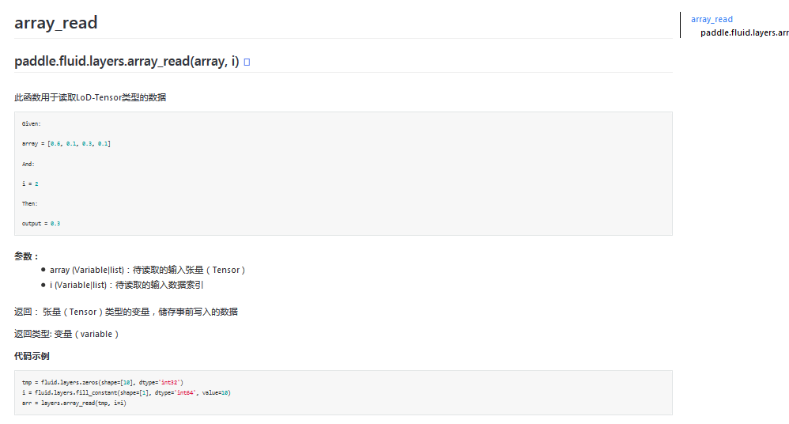

# API-translation

  欢迎来到PaddlePaddle API reference翻译项目，本项目旨在将PaddlePaddle英文版[API Reference](http://paddlepaddle.org/documentation/api/zh/1.0/fluid.html)
翻译成简体中文

## 翻译注意事项

### 翻译文档的版本

本次翻译在PaddlePaddle Fluid **1.0** 的基础上展开

### 确定API名称和位置
  - 请确定需要翻译的API名称以及位置
  
  请在[API Reference](http://paddlepaddle.org/documentation/api/zh/1.0/fluid.html)中查看或使用官网搜索工具。在官网文档中，可以看到左侧导航栏显示`fluid`,`fluid.layers`等，每一行代表一种分类，对应[这里](https://github.com/PaddlePaddle/FluidDoc/tree/release/1.0/doc/fluid/api)的一个文件，例如`fluid.layers`对应`layers.rst`
  
  - 翻译规范
  
  请使用标准rst语法进行翻译，这里提供了一个例子： [array_read](https://github.com/shanyi15/API-translation/blob/master/cn_array_read.rst)

  在官网预览效果如下：
  
  
  翻译时请严格遵照[中文技术文档写作规范](https://github.com/ruanyf/document-style-guide)，部分深度学习专业词汇应保留英文说法
  
  在翻译时，如发现英文版API reference不易理解，也可以参考[python代码](https://github.com/PaddlePaddle/Paddle/tree/release/1.0.0/python/paddle/fluid) 来帮助理解
  
  - pr提交 
  
  提交pr有两种方式：1)使用git工具、2)使用网页，大家可以根据自己对git工具的掌握程度自行选择，下面对这两种方式做一个简要介绍。
  
  **使用git工具**
  1. 首先请 fork FluidDoc仓库 并在本地 clone 你fork的FluidDoc
  
  ```bash
  git clone https://github.com/<username>/FluidDoc.git
  ```
  `<username>`是你的git用户名
  
  2. 关联远程仓库（原FluidDoc）
  
  ```bash
  git remote add upstream https://github.com/PaddlePaddle/FluidDoc.git
  ```
  完成后在终端输入 `git remote -v` 应该可以看到下列状态：
  ```
  $ git remote -v
  origin  https://github.com/xxxxx/FluidDoc.git (fetch)
  origin  https://github.com/xxxxx/FluidDoc.git (push)
  upstream        git@github.com:PaddlePaddle/FluidDoc.git (fetch)
  upstream        git@github.com:PaddlePaddle/FluidDoc.git (push)
  ```
  
  3. 创建新分支
  ```bash
  git checkout -b translation
  ```
  4. 每次修改前请确定当前分支与远端最新状态保持同步
  ```bash
  git fetch
  git pull upstream develop
  ```
  5. 在当前分支进行您的操作
  
  6. 完成后提交修改
  ```bash
  //查看当前修改状态
  git status
  
  //将需要的修改添加到暂缓区
  git add <file_name>
  
  //提交commit
  git commit -m "wirte your commit message"
  
  //上传到远端
  git push origin yourbranch:newbranch
  ```
  7. 上传成功后进入[FluidDoc](https://github.com/PaddlePaddle/FluidDoc),可以在首页看到一个提交PR的提醒：
  
  确认没问题，可以回到页面顶端，补充PR名与说明信息，点击create pull request。这样就建立了一个pr：
  
  
  8. 提交成功，请您将pr的链接告知我们。
  后续如果有review意见，您将会通过在github里留的邮箱得到反馈，请根据review意见及时提交您的修改稿
  
  
  **使用网页提交**
  请参考这个[说明](https://shimo.im/docs/5MRz2RFyUYESBEWJ/ )
  
  添加reviewer：请在[这里](https://github.com/PaddlePaddle/Paddle/tree/release/1.0.0/python/paddle/fluid)blame去查看每个api的原作者，并在pr的comment中@原作者的github名字
  
  
  
## FAQ

### 发现英文Reference写的不好怎么办？
  如上文所述，可查看[python代码](https://github.com/PaddlePaddle/Paddle/tree/release/1.0.0/python/paddle/fluid) 来帮助理解，也可以提交[Issue](https://github.com/PaddlePaddle/Paddle/issues/new)


 
