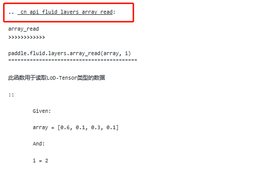

# PaddlePaddle API 翻译项目

  欢迎来到PaddlePaddle API reference翻译项目！

## 简介

  - 背景
  
  由于PaddlePaddle的中文用户占比较大，用户对中文API文档的需求比较强烈，因而计划将PaddlePaddle英文版API Reference翻译成简体中文
  
  - 翻译内容
  
  PaddlePaddle [1.0版 API Reference](http://paddlepaddle.org/documentation/api/zh/1.0/fluid.html)
  
  - 任务量和时间节点
  
  计划翻译API约301个（不包含“别名”API，例如[这里](http://paddlepaddle.org/documentation/api/zh/1.1/optimizer.html#adadelta)）。本项目于11月1日启动，包括翻译、review、润色的时间，共计约6周，计划于12月15日前完成。
  
## 翻译步骤

  - 明确格式要求
  
  请使用标准rst语法进行翻译，这里提供了一个例子： [array_read](https://github.com/shanyi15/API-translation/blob/master/layers_cn.rst)

  上述rst文档在官网渲染后显示效果如下：
  
  
  翻译时请严格遵照[中文技术文档写作规范](https://github.com/ruanyf/document-style-guide)，部分深度学习专业词汇应保留英文说法，例如：activation（激活函数）
  
  在翻译时，如发现英文版API reference不易理解，请参考[python源代码](https://github.com/PaddlePaddle/Paddle/tree/release/1.0.0/python/paddle/fluid) 来帮助理解
  
**注意！！**
   
   为了保证从其他文档可以正确跳转到某个API Reference（效果请参考[这里](http://paddlepaddle.org/documentation/api/zh/1.1/api_guides/low_level/layers/detection.html)从API Guide文档到API Reference文档的跳转），在每一个api中文翻译前，请首先为此api添加关键字。
   
   关键字的格式为 `.. _cn_api_fluid_layers_array_read:`，写法为：
   
   “cn”+“api所属类别”+“api名”，请注意英文名前有一个 `_` 结尾有一个 `:`，这里以layers中的array_read为例：
   
    
  
  - 需要翻译的API
  
    请根据拿到的Excel中所列的API名称，在[API Reference](http://paddlepaddle.org/documentation/api/zh/1.0/fluid.html)中查看
    
  - 提交位置
  
   在官网英文版文档中，左侧导航栏显示`fluid`,`fluid.layers`等，每一行代表一种分类，对应[Github 源文件](https://github.com/PaddlePaddle/FluidDoc/tree/release/1.0/doc/fluid/api)的一个文件，例如`fluid.layers`对应`layers.rst`
   
   中文翻译稿的源文件也需要按照类似的方式命名，例如中文版layers，其在Fluiddoc/doc/fluid/api下的文件名应为：`layers_cn.rst`
   
   请按照大类（请参考Fluiddoc/doc/fluid/api）下面英文版的分类方式，来创建对应的中文版文档
  
  - 如何提交
  
    PaddlePaddle文档使用Github中的[Fluiddoc](https://github.com/PaddlePaddle/FluidDoc)来统一管理，您需要了解git的基本操作，并通过Pull Request的方式提交您的翻译稿。提交Pull Request可通过git工具或网页两种方法提交，下面分别简单介绍：
    
 ### 使用Git工具
 
  1. 首先请 fork FluidDoc仓库 并在本地 clone 你fork的FluidDoc
  
  ```bash
  git clone https://github.com/<username>/FluidDoc.git
  ```
  `<username>`是你的git用户名
  
  2. 关联远程仓库（原FluidDoc）
  
  ```bash
  git remote add upstream https://github.com/PaddlePaddle/FluidDoc.git
  ```
  完成后在终端输入 `git remote -v` 应该可以看到下列状态：
  ```
  $ git remote -v
  origin  https://github.com/xxxxx/FluidDoc.git (fetch)
  origin  https://github.com/xxxxx/FluidDoc.git (push)
  upstream        git@github.com:PaddlePaddle/FluidDoc.git (fetch)
  upstream        git@github.com:PaddlePaddle/FluidDoc.git (push)
  ```
  
  3. 创建新分支
  ```bash
  git checkout -b translation
  ```
  4. 每次修改前请确定当前分支与远端最新状态保持同步
  ```bash
  git fetch
  git pull upstream develop
  ```
  5. 在当前分支进行您的操作
  
  6. 完成后提交修改
  ```bash
  //查看当前修改状态
  git status
  
  //将需要的修改添加到暂缓区
  git add <file_name>
  
  //提交commit
  git commit -m "wirte your commit message"
  
  //上传到远端
  git push origin yourbranch:newbranch
  ```
  7. 上传成功后进入[FluidDoc](https://github.com/PaddlePaddle/FluidDoc),可以在首页看到一个提交PR的提醒：
  
  确认没问题，可以回到页面顶端，补充PR名与说明信息，点击create pull request。这样就建立了一个pr：
  
  
  8. 提交成功，请您将pr的链接告知我们。
  后续如果有review意见，您将会通过在github里留的邮箱得到反馈，请根据review意见及时提交您的修改稿
  
### 使用网页提交

  请参考这个[说明](https://shimo.im/docs/5MRz2RFyUYESBEWJ/ )
  
## Review流程简介

  - 背景
  
  请在提交pr时添加Reviewer。由于API文档正确性非常重要，因此每一篇中文翻译稿都需要API代码作者Review通过后才可以Merge
  
  - 如何找到原作者
  
  请在[这里](https://github.com/PaddlePaddle/Paddle/tree/release/1.0.0/python/paddle/fluid)blame去查看每个api的原作者
  
  - 如何添加原作者为您提交pr的reviewer
  
   请在pr的comment中@原作者的github名字
 
## FAQ

### 觉得英文版的API文档写得不够完善，我应该怎样做？
  
  本项目的目标在于英译汉API Reference，如果觉得英文版文档写得不够完善，影响您的翻译，请
  
  第一步：查看[python源代码](https://github.com/PaddlePaddle/Paddle/tree/release/1.0.0/python/paddle/fluid) 来帮助理解，并在此基础上进行翻译。
  
  第二步：将觉得有问题的地方，[提Issue在Paddle repo](https://github.com/PaddlePaddle/Paddle/issues/new)
  
  更多地，如果想修改英文版API Reference，为Paddle贡献代码，请在Paddle Repo中提交Pull Request


 
